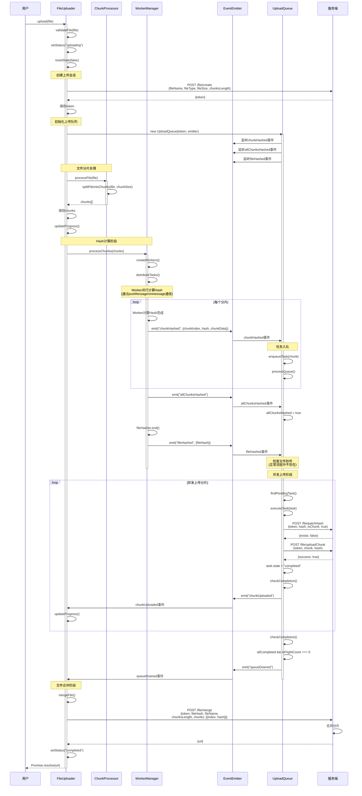

# 正常文件上传流程时序图

## 场景描述

展示完整的大文件分片上传流程，包括文件验证、会话创建、分片切割、Hash计算、并发上传和文件合并等步骤。

## 时序图

## 关键流程说明

1. **文件验证与会话创建**：用户调用 `upload()` 方法后，FileUploader 首先验证文件，设置状态为 `uploading`，重置状态，然后创建上传会话获取 token。

2. **初始化上传队列**：创建 UploadQueue 实例，并设置事件监听器监听 `chunkHashed`、`allChunksHashed` 和 `fileHashed` 事件。

3. **分片切割**：ChunkProcessor 将文件按照配置的 chunkSize 切割成多个分片，FileUploader 保存分片并更新初始进度。

4. **Hash计算**：WorkerManager 创建 Worker 线程池，通过 `postMessage`/`onmessage` 机制并行计算每个分片的 Hash。计算完成后通过 EventEmitter 触发 `chunkHashed` 事件。所有分片计算完成后触发 `allChunksHashed` 事件，然后计算文件 Hash 并触发 `fileHashed` 事件。

5. **任务入队**：UploadQueue 监听 `chunkHashed` 事件，将任务加入队列并调用 `processQueue()` 开始处理。

6. **并发上传**：`processQueue()` 通过 `findPendingTask()` 查找待处理任务，调用 `executeTask()` 执行上传。每个任务先检查分片是否存在（`patchHash`），不存在则上传分片（`uploadChunk`）。任务完成后调用 `checkCompletion()` 检查是否所有任务完成。

7. **文件合并**：所有分片上传完成后（`allCompleted && inFlightCount === 0`），触发 `queueDrained` 事件，FileUploader 调用合并接口完成文件合并。合并接口需要 `token`、`fileHash`、`fileName`、`chunksLength` 和 `chunks` 数组（包含每个分片的 `index` 和 `hash`）。

8. **完成**：服务端返回文件 URL，上传状态切换为 `completed`，Promise 解析返回 URL。

## 注意事项

- 本时序图展示正常上传流程，不包括文件秒传和分片秒传场景（这些场景在 `02-file-instant-upload.md` 和 `03-chunk-instant-upload.md` 中详细描述）。
- Hash 计算的多线程机制和 ResultBuffer 排序机制详见 `04-multi-thread-hash.md`。
- 并发上传控制的详细机制详见 `05-concurrent-upload.md`。
- 所有事件通过 EventEmitter（mitt）传递，实现组件间的解耦通信。

