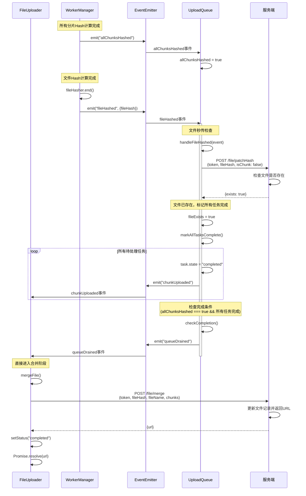

# 文件秒传场景时序图

## 场景描述

当文件 Hash 计算完成后，检查发现文件已存在于服务端，此时跳过所有分片上传，直接进入合并阶段获取文件 URL。

## 时序图

## 关键流程说明

1. **所有分片Hash计算完成**：WorkerManager 完成所有分片 Hash 计算后，触发 `allChunksHashed` 事件，UploadQueue 设置 `allChunksHashed = true` 标志。

2. **文件Hash计算完成**：WorkerManager 完成文件 Hash 计算后，触发 `fileHashed` 事件（多线程模式下，此时所有分片 Hash 已完成）。

3. **秒传检查**：UploadQueue 监听 `fileHashed` 事件，立即请求服务端检查文件是否存在。

4. **文件已存在**：服务端返回 `exists: true`，表示文件已存在。

5. **跳过上传**：UploadQueue 将所有待上传和正在上传的任务标记为完成，触发 `chunkUploaded` 事件更新进度。

6. **检查完成条件**：调用 `checkCompletion()`，此时 `allChunksHashed === true` 且所有任务完成，触发 `queueDrained` 事件。

7. **触发合并**：FileUploader 监听 `queueDrained` 事件，调用 `mergeFile()` 直接进入合并阶段。

8. **完成**：服务端更新文件记录并返回 URL，上传流程完成。整个过程跳过了所有分片的上传步骤，实现了文件秒传。

