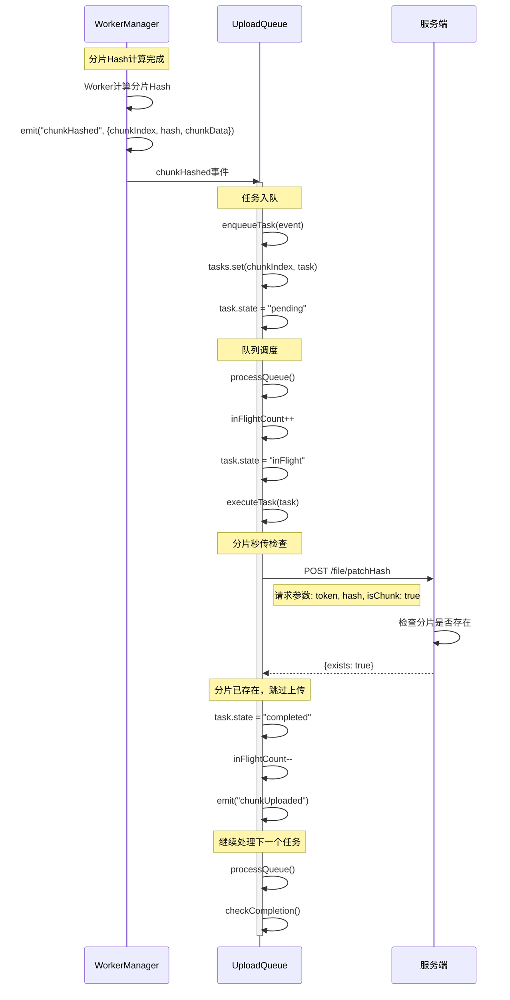

# 分片秒传场景时序图

## 场景描述

当某个分片的 Hash 计算完成后，检查发现该分片已存在于服务端，此时跳过该分片的上传，直接标记为完成。

## 时序图

## 关键流程说明

1. **分片Hash计算完成**：WorkerManager 完成某个分片的 Hash 计算，触发 `chunkHashed` 事件。

2. **任务入队**：UploadQueue 监听事件，将分片上传任务加入队列，状态设置为 `pending`。

3. **队列调度**：队列根据并发数限制，增加 `inFlightCount` 计数器，将 `pending` 任务转为 `inFlight` 状态，并调用 `executeTask()` 开始执行任务。

4. **秒传检查**：`executeTask()` 执行任务时，首先请求服务端检查该分片 Hash 是否已存在。

5. **跳过上传**：服务端返回 `exists: true`，表示分片已存在。任务直接标记为 `completed`，跳过实际上传步骤。

6. **继续处理**：减少 `inFlightCount`，触发 `chunkUploaded` 事件更新进度，然后继续处理队列中的下一个任务。

## 优势

- **减少网络传输**：已存在的分片无需重复上传，节省带宽。
- **提升上传速度**：跳过已存在分片的上传，整体上传时间缩短。
- **节省存储空间**：服务端基于 Hash 去重，相同分片只存储一份。

