# 多线程Hash计算场景时序图

## 场景描述

WorkerManager 使用多个 Worker 线程并行计算分片 Hash，通过 ResultBuffer 机制保证结果按顺序发出，避免乱序问题。

## 时序图

```mermaid
sequenceDiagram
    participant WM as WorkerManager
    participant W1 as Worker1
    participant W2 as Worker2
    participant W3 as Worker3
    participant RB as ResultBuffer
    participant UQ as UploadQueue

    Note over WM: 初始化阶段
    WM->>WM: processChunks(chunks)
    WM->>RB: new ResultBuffer(totalChunks, onChunkReady, onAllReady)
    activate RB
    WM->>WM: createWorkers()
    WM->>WM: 创建N个Worker实例
    WM->>WM: distributeTasks()
    
    Note over WM: 任务分发（轮询分配）
    WM->>WM: distributeTasksToMultipleWorkers()
    WM->>W1: postMessage({type: "hashChunk", chunkIndex: 0, chunkData})
    WM->>W2: postMessage({type: "hashChunk", chunkIndex: 1, chunkData})
    WM->>W3: postMessage({type: "hashChunk", chunkIndex: 2, chunkData})
    WM->>W1: postMessage({type: "hashChunk", chunkIndex: 3, chunkData})
    WM->>W2: postMessage({type: "hashChunk", chunkIndex: 4, chunkData})
    
    Note over W1,W3: 并行计算Hash
    activate W1
    activate W2
    activate W3
    
    W2->>WM: onmessage({type: "chunkHashed", chunkIndex: 1, hash, chunkData})
    W3->>WM: onmessage({type: "chunkHashed", chunkIndex: 2, hash, chunkData})
    W1->>WM: onmessage({type: "chunkHashed", chunkIndex: 0, hash, chunkData})
    
    Note over WM: 处理Worker响应
    WM->>WM: handleWorkerMessage(response, worker)
    WM->>WM: handleChunkHashed(response, worker)
    WM->>WM: 构建chunkEvent: {chunkIndex, hash, chunkData}
    WM->>RB: add(0, chunkEvent)
    WM->>RB: add(1, chunkEvent)
    WM->>RB: add(2, chunkEvent)
    
    Note over RB: 结果排序处理（flush循环处理连续结果）
    RB->>RB: add(0): buffer.set(0, event)
    RB->>RB: flush() - while循环检查nextExpectedIndex=0
    RB->>RB: buffer.has(0) = true，处理0
    RB->>RB: buffer.delete(0)
    RB->>WM: onChunkReady(chunkIndex: 0)
    RB->>RB: nextExpectedIndex = 1
    RB->>RB: buffer.has(1) = false，停止循环
    
    RB->>RB: add(1): buffer.set(1, event)
    RB->>RB: flush() - while循环检查nextExpectedIndex=1
    RB->>RB: buffer.has(1) = true，处理1
    RB->>RB: buffer.delete(1)
    RB->>WM: onChunkReady(chunkIndex: 1)
    RB->>RB: nextExpectedIndex = 2
    RB->>RB: buffer.has(2) = false，停止循环
    
    RB->>RB: add(2): buffer.set(2, event)
    RB->>RB: flush() - while循环检查nextExpectedIndex=2
    RB->>RB: buffer.has(2) = true，处理2
    RB->>RB: buffer.delete(2)
    RB->>WM: onChunkReady(chunkIndex: 2)
    RB->>RB: nextExpectedIndex = 3
    RB->>RB: buffer.has(3) = false，停止循环
    
    Note over WM: 按顺序发出事件并追加到文件Hash
    WM->>WM: if (!isAborted) emit("chunkHashed", event)
    WM->>WM: fileHasher.append(event.chunkData)
    WM->>UQ: chunkHashed事件(chunkIndex: 0)
    
    WM->>WM: if (!isAborted) emit("chunkHashed", event)
    WM->>WM: fileHasher.append(event.chunkData)
    WM->>UQ: chunkHashed事件(chunkIndex: 1)
    
    WM->>WM: if (!isAborted) emit("chunkHashed", event)
    WM->>WM: fileHasher.append(event.chunkData)
    WM->>UQ: chunkHashed事件(chunkIndex: 2)
    
    Note over W1,W3: 继续处理剩余分片
    W1->>WM: onmessage({type: "chunkHashed", chunkIndex: 3, hash, chunkData})
    WM->>WM: handleWorkerMessage(response, worker)
    WM->>WM: handleChunkHashed(response, worker)
    WM->>RB: add(3, chunkEvent)
    RB->>RB: add(3): buffer.set(3, event)
    RB->>RB: flush() - while循环检查nextExpectedIndex=3
    RB->>RB: buffer.has(3) = true，处理3
    RB->>RB: buffer.delete(3)
    RB->>WM: onChunkReady(chunkIndex: 3)
    RB->>RB: nextExpectedIndex = 4
    RB->>RB: buffer.has(4) = false，停止循环
    WM->>WM: if (!isAborted) emit("chunkHashed", event)
    WM->>WM: fileHasher.append(event.chunkData)
    WM->>UQ: chunkHashed事件(chunkIndex: 3)
    
    Note over WM: 所有分片处理完成
    RB->>RB: flush() - while循环检查nextExpectedIndex
    RB->>RB: nextExpectedIndex >= totalChunks，触发完成
    RB->>WM: onAllReady()
    WM->>WM: if (!isAborted) emit("allChunksHashed")
    WM->>WM: fileHasher.end()
    WM->>WM: if (!isAborted) emit("fileHashed", {fileHash})
    
    deactivate W1
    deactivate W2
    deactivate W3
    deactivate RB
```

## 关键流程说明

1. **初始化顺序**：WorkerManager 先创建 ResultBuffer，再创建 Worker 实例，最后调用 `distributeTasks()` 分发任务。

2. **Worker创建**：WorkerManager 根据硬件并发数创建多个 Worker 实例（示例中为3个）。

3. **任务分发**：调用 `distributeTasksToMultipleWorkers()` 使用轮询算法将分片任务均匀分配给所有 Worker，实现负载均衡。

4. **并行计算**：多个 Worker 同时计算不同分片的 Hash，结果可能乱序返回（如示例中先返回 chunkIndex 1, 2, 0）。

5. **Worker响应处理**：Worker 返回结果后，通过 `handleWorkerMessage()` 和 `handleChunkHashed()` 处理，构建 `chunkEvent` 对象（包含 chunkIndex、hash、chunkData）。

6. **结果缓冲**：ResultBuffer 接收所有 Worker 返回的结果，通过 `add()` 方法存入缓冲区，每次 `add()` 都会立即调用 `flush()`。

7. **顺序输出**：ResultBuffer 的 `flush()` 方法使用 while 循环处理所有连续的结果。从 `nextExpectedIndex` 开始，只要缓冲区中存在连续的结果，就会依次调用 `onChunkReady()` 回调。每次 `add()` 调用后都会立即调用 `flush()`，如果 `nextExpectedIndex` 对应的结果存在，就会处理并继续检查下一个索引，直到遇到缺失的索引为止。

8. **事件发出与文件Hash累积**：`onChunkReady` 回调中，在检查 `isAborted` 后发出 `chunkHashed` 事件，并在多线程模式下调用 `fileHasher.append(event.chunkData)` 累积分片数据。

9. **文件Hash计算**：所有分片处理完成后，`onAllReady` 回调中调用 `fileHasher.end()` 在主线程中计算最终的文件 Hash（多线程模式下）。

## 优势

- **性能提升**：充分利用多核 CPU，Hash 计算速度接近线程数倍。
- **顺序保证**：ResultBuffer 机制确保分片事件按索引顺序发出，避免乱序问题。
- **负载均衡**：轮询分配策略确保任务均匀分布到各个 Worker。

