# 并发上传控制场景时序图

## 场景描述

UploadQueue 实现并发上传控制，通过队列机制管理上传任务，控制同时上传的分片数量，确保不超过配置的并发数限制。

## 时序图

```mermaid
sequenceDiagram
    participant WM as WorkerManager
    participant UQ as UploadQueue
    participant Server as 服务端

    Note over WM: 分片Hash计算完成
    WM->>UQ: emit("chunkHashed", {chunkIndex: 0})
    WM->>UQ: emit("chunkHashed", {chunkIndex: 1})
    WM->>UQ: emit("chunkHashed", {chunkIndex: 2})
    WM->>UQ: emit("chunkHashed", {chunkIndex: 3})
    WM->>UQ: emit("chunkHashed", {chunkIndex: 4})
    
    activate UQ
    
    Note over UQ: 任务入队（concurrency = 3）
    Note over UQ: 每次enqueueTask后调用processQueue()，processQueue()内部使用while循环处理多个任务
    UQ->>UQ: enqueueTask(chunkIndex: 0)
    UQ->>UQ: tasks.set(0, {state: "pending"})
    UQ->>UQ: processQueue()
    
    UQ->>UQ: enqueueTask(chunkIndex: 1)
    UQ->>UQ: tasks.set(1, {state: "pending"})
    UQ->>UQ: processQueue()
    
    UQ->>UQ: enqueueTask(chunkIndex: 2)
    UQ->>UQ: tasks.set(2, {state: "pending"})
    UQ->>UQ: processQueue()
    
    Note over UQ: processQueue() - while循环展开（达到并发上限）
    UQ->>UQ: inFlightCount = 0 < 3，执行任务0
    UQ->>UQ: inFlightCount++ (inFlightCount = 1)
    UQ->>UQ: task[0].state = "inFlight"
    UQ->>UQ: executeTask(task[0])
    
    UQ->>UQ: while循环继续：inFlightCount = 1 < 3，执行任务1
    UQ->>UQ: inFlightCount++ (inFlightCount = 2)
    UQ->>UQ: task[1].state = "inFlight"
    UQ->>UQ: executeTask(task[1])
    
    UQ->>UQ: while循环继续：inFlightCount = 2 < 3，执行任务2
    UQ->>UQ: inFlightCount++ (inFlightCount = 3)
    UQ->>UQ: task[2].state = "inFlight"
    UQ->>UQ: executeTask(task[2])
    
    Note over UQ: 任务3、4等待（inFlightCount = 3，达到上限）
    UQ->>UQ: enqueueTask(chunkIndex: 3)
    UQ->>UQ: tasks.set(3, {state: "pending"})
    UQ->>UQ: processQueue()
    Note over UQ: inFlightCount = 3 >= 3，任务3保持pending
    
    UQ->>UQ: enqueueTask(chunkIndex: 4)
    UQ->>UQ: tasks.set(4, {state: "pending"})
    UQ->>UQ: processQueue()
    Note over UQ: inFlightCount = 3 >= 3，任务4保持pending
    
    Note over UQ,Server: 并发上传执行（完成顺序可能不同）
    par 任务0上传
        UQ->>Server: POST /file/patchHash(token, hash0, isChunk: true)
        Server-->>UQ: {exists: false}
        UQ->>Server: POST /file/uploadChunk(token, chunk0, hash0)
        Server-->>UQ: {success: true}
        UQ->>UQ: task[0].state = "completed"
        UQ->>UQ: inFlightCount = 2
        UQ->>UQ: emit("chunkUploaded")
        UQ->>UQ: processQueue()
    and 任务1上传
        UQ->>Server: POST /file/patchHash(token, hash1, isChunk: true)
        Server-->>UQ: {exists: false}
        UQ->>Server: POST /file/uploadChunk(token, chunk1, hash1)
        Server-->>UQ: {success: true}
        UQ->>UQ: task[1].state = "completed"
        UQ->>UQ: inFlightCount = 1
        UQ->>UQ: emit("chunkUploaded")
        UQ->>UQ: processQueue()
    and 任务2上传
        UQ->>Server: POST /file/patchHash(token, hash2, isChunk: true)
        Server-->>UQ: {exists: false}
        UQ->>Server: POST /file/uploadChunk(token, chunk2, hash2)
        Server-->>UQ: {success: true}
        UQ->>UQ: task[2].state = "completed"
        UQ->>UQ: inFlightCount = 0
        UQ->>UQ: emit("chunkUploaded")
        UQ->>UQ: processQueue()
    end
    
    Note over UQ: processQueue() - while循环展开（继续处理等待中的任务）
    UQ->>UQ: inFlightCount = 0 < 3，执行任务3
    UQ->>UQ: inFlightCount++ (inFlightCount = 1)
    UQ->>UQ: task[3].state = "inFlight"
    UQ->>UQ: executeTask(task[3])
    
    UQ->>UQ: while循环继续：inFlightCount = 1 < 3，执行任务4
    UQ->>UQ: inFlightCount++ (inFlightCount = 2)
    UQ->>UQ: task[4].state = "inFlight"
    UQ->>UQ: executeTask(task[4])
    
    Note over UQ: 所有任务完成
    UQ->>UQ: checkCompletion()
    UQ->>UQ: allCompleted && inFlightCount === 0
    UQ->>UQ: emit("queueDrained")
    
    deactivate UQ
```

## 关键流程说明

1. **任务入队**：WorkerManager 触发 `chunkHashed` 事件，UploadQueue 将任务加入队列，状态设置为 `pending`。

2. **并发控制**：队列根据 `concurrency` 配置（示例中为3），控制同时执行的任务数量。

3. **任务调度**：`processQueue()` 方法检查 `inFlightCount`，如果小于并发数上限，则将 `pending` 任务转为 `inFlight` 并执行。

4. **并发执行**：多个任务同时上传，每个任务先检查分片是否存在，不存在则上传分片。

5. **任务完成**：任务完成后，状态改为 `completed`，`inFlightCount` 减1，触发 `chunkUploaded` 事件。

6. **继续调度**：任务完成后再次调用 `processQueue()`，处理等待中的 `pending` 任务。

7. **队列完成**：所有任务完成后，检查是否满足完成条件（所有任务完成且无进行中任务），触发 `queueDrained` 事件。

## 优势

- **控制服务器负载**：限制并发数，避免对服务器造成过大压力。
- **平衡上传速度**：合理的并发数可以在速度和稳定性之间取得平衡。
- **自动调度**：队列自动管理任务状态转换，无需手动控制。

