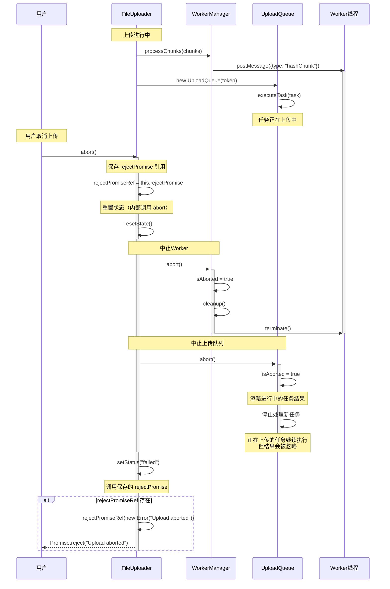

# 取消上传场景时序图

## 场景描述

用户主动取消上传时，FileUploader 需要中止所有正在进行的操作，包括 Worker 线程、上传队列，并清理相关资源。

## 时序图

## 关键流程说明

1. **上传进行中**：FileUploader 正在处理文件上传，WorkerManager 在计算 Hash，UploadQueue 在上传分片。

2. **用户取消**：用户调用 `abort()` 方法取消上传。

3. **保存 Promise 引用**：FileUploader 在调用 `resetState()` 之前保存 `rejectPromise` 的引用，因为 `resetState()` 会将其清空。

4. **重置状态**：FileUploader 调用 `resetState()` 重置内部状态，该方法内部会：
   - 清理各种状态变量（token、fileHash、chunks 等）
   - 调用 WorkerManager 的 `abort()` 方法
   - 调用 UploadQueue 的 `abort()` 方法（如果存在）

5. **中止Worker**（在 `resetState()` 内部执行）：
   - FileUploader 通过 `resetState()` 调用 WorkerManager 的 `abort()` 方法
   - WorkerManager 设置 `isAborted = true`
   - 调用 `cleanup()` 终止所有 Worker 线程
   - Worker 线程被强制终止（`terminate()` 是同步方法），正在计算的 Hash 任务被中断

6. **中止上传队列**（在 `resetState()` 内部执行）：
   - FileUploader 通过 `resetState()` 调用 UploadQueue 的 `abort()` 方法
   - UploadQueue 设置 `isAborted = true`
   - 停止处理新任务（`processQueue()` 会检查 `isAborted` 并直接返回）
   - 正在上传的任务会继续执行，但结果会被忽略（`executeTask()` 会检查 `isAborted`）

7. **设置状态**：FileUploader 调用 `setStatus("failed")` 将状态设置为失败。

8. **拒绝 Promise**：FileUploader 使用保存的 `rejectPromiseRef` 调用 `rejectPromise()`，将 Promise 状态设置为 rejected，返回错误信息给用户。

9. **资源清理**：所有资源被清理，上传流程完全中止。

## 注意事项

- **Promise 引用保存**：必须在 `resetState()` 之前保存 `rejectPromise` 引用，因为 `resetState()` 会将其清空，否则无法正确拒绝 Promise。
- **Worker终止**：Worker 线程会被强制终止（`terminate()` 是同步方法），正在计算的 Hash 任务无法恢复。
- **网络请求**：正在进行的网络请求（上传分片）不会被主动取消，但结果会被忽略。
- **状态一致性**：所有组件都会检查 `isAborted` 标志，确保取消操作的一致性。
- **资源释放**：Worker 线程和事件监听器会被正确清理，避免内存泄漏。
- **调用顺序**：`resetState()` 内部会调用 `workerManager.abort()` 和 `uploadQueue.abort()`，这些调用是嵌套在 `resetState()` 内部的，而不是外部单独调用。

