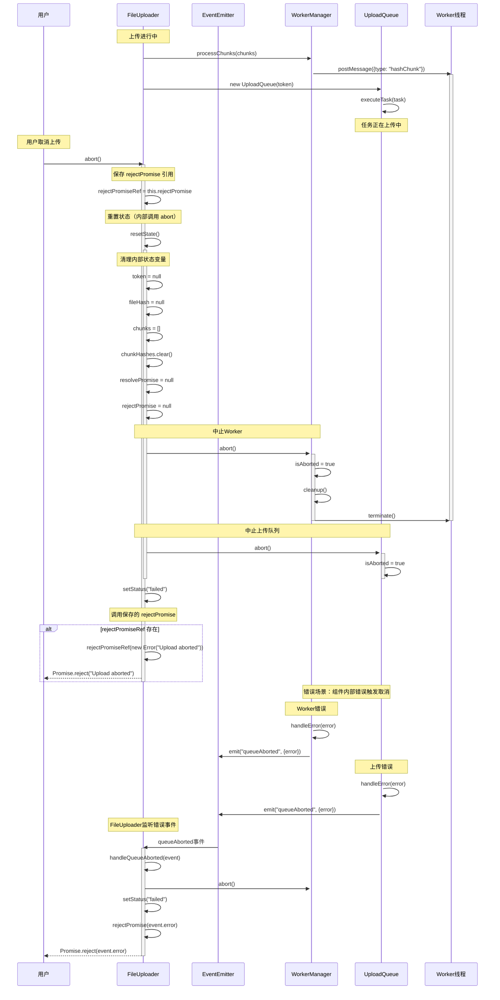

# 取消上传场景时序图

## 场景描述

用户主动取消上传时，FileUploader 需要中止所有正在进行的操作，包括 Worker 线程、上传队列，并清理相关资源。同时也展示了通过事件系统触发的取消流程。

## 时序图

## 关键流程说明

### 用户主动取消流程

1. **上传进行中**：FileUploader 正在处理文件上传，WorkerManager 在计算 Hash，UploadQueue 在上传分片。

2. **用户取消**：用户调用 `abort()` 方法取消上传。

3. **保存 Promise 引用**：FileUploader 在调用 `resetState()` 之前保存 `rejectPromise` 的引用，因为 `resetState()` 会将其清空。

4. **重置状态**：FileUploader 调用 `resetState()` 重置内部状态，该方法内部会：
   - 清理各种状态变量（token、fileHash、chunks、chunkHashes 等）
   - 清空 resolvePromise 和 rejectPromise 引用
   - 调用 WorkerManager 的 `abort()` 方法
   - 调用 UploadQueue 的 `abort()` 方法（如果存在）

5. **中止Worker**（在 `resetState()` 内部执行）：
   - FileUploader 通过 `resetState()` 调用 WorkerManager 的 `abort()` 方法
   - WorkerManager 设置 `isAborted = true`
   - 调用 `cleanup()` 终止所有 Worker 线程
   - Worker 线程被强制终止（`terminate()` 是同步方法），正在计算的 Hash 任务被中断

6. **中止上传队列**（在 `resetState()` 内部执行）：
   - FileUploader 通过 `resetState()` 调用 UploadQueue 的 `abort()` 方法
   - UploadQueue 设置 `isAborted = true`
   - 停止处理新任务（`processQueue()` 会检查 `isAborted` 并直接返回）
   - 正在上传的任务会继续执行，但结果会被忽略（`executeTask()` 会检查 `isAborted`）

7. **设置状态**：FileUploader 调用 `setStatus("failed")` 将状态设置为失败。

8. **拒绝 Promise**：FileUploader 使用保存的 `rejectPromiseRef` 调用 `rejectPromise()`，将 Promise 状态设置为 rejected，返回错误信息给用户。

### 错误触发取消流程

9. **组件内部错误**：
   - WorkerManager 遇到错误时调用 `handleError(error)`，通过 EventEmitter 触发 `queueAborted` 事件
   - UploadQueue 遇到错误时调用 `handleError(error)`，通过 EventEmitter 触发 `queueAborted` 事件

10. **事件传播**：
    - FileUploader 监听 `queueAborted` 事件
    - 收到事件后调用 `handleQueueAborted(event)` 方法
    - 方法内部会中止 WorkerManager、设置失败状态并使用当前错误信息拒绝 Promise

### isAborted 检查位置

各组件中的 `isAborted` 检查确保取消操作的一致性：

**WorkerManager 检查位置**：
- `worker.onmessage` 回调：收到 Worker 响应时检查
- ResultBuffer 的 `onChunkReady` 回调：处理分片结果时检查
- ResultBuffer 的 `onAllReady` 回调：处理全部完成时检查

**UploadQueue 检查位置**：
- `chunkHashed` 事件处理：新分片 Hash 完成时检查
- `allChunksHashed` 事件处理：所有分片 Hash 完成时检查
- `fileHashed` 事件处理：文件 Hash 完成时检查
- `enqueueTask`：任务入队时检查
- `processQueue`：处理队列时检查
- `executeTask`：执行任务时检查
- `checkCompletion`：检查完成状态时检查

## 注意事项

### Promise 引用管理
- **引用保存时机**：必须在 `resetState()` 之前保存 `rejectPromise` 引用，因为 `resetState()` 会将其清空，否则无法正确拒绝 Promise
- **错误处理差异**：用户主动取消使用固定的错误信息 "Upload aborted"，而组件错误触发取消会传递具体的错误信息

### Worker 管理
- **同步终止**：Worker 线程会被强制终止（`terminate()` 是同步方法），正在计算的 Hash 任务无法恢复
- **资源清理**：`cleanup()` 方法会清空 workers 数组、重置 resultBuffer 和 fileHasher

### 网络请求处理
- **不主动取消**：正在进行的网络请求（上传分片）不会被主动取消，但结果会被忽略
- **结果忽略**：所有 `isAborted` 检查确保已发出的请求结果不会触发后续处理

### 状态一致性
- **全局标志**：所有组件都会检查 `isAborted` 标志，确保取消操作的一致性
- **检查频率**：在每个关键操作前都会检查，避免无效的资源消耗

### 事件驱动机制
- **双向触发**：取消既可以由用户主动触发（abort方法），也可以由组件内部错误触发（queueAborted事件）
- **事件传播**：通过 EventEmitter 实现 WorkerManager 和 UploadQueue 向 FileUploader 的错误传播
- **解耦设计**：事件驱动机制降低了组件间的耦合度

### 资源释放
- **完整清理**：Worker 线程、状态变量、Promise 引用都会被正确清理，避免内存泄漏
- **顺序保证**：`resetState()` 内部的调用顺序确保了资源的正确释放顺序

### 并发场景
- **多任务处理**：在并发上传场景下，取消操作会同时影响所有进行中的任务
- **状态保护**：isAborted 标志确保新任务不会在取消后继续入队执行

